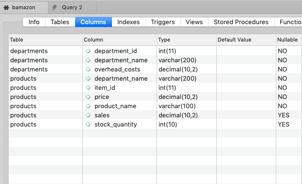

# bamazon

## What it is...

bamazon is a CLI app that resembles a storefront.  The app is accessing a SQL database running on a mySQL server. The database includes two tables:

1. products
2. departments

*products* contains a number of products, each with their own prices, inventory and belonging to a department. Utilizing this app and running ```node bamazon-customer.js``` in your terminal allows you to "buy" items from the store.

Running ```node bamazon-manager.js``` in your terminal allows you to update the store with new items, view low inventory, view all items, and update quantities for existing items.

*departments* contains a list of departments, and their overhead costs.  This is accessed by running ```node bamazon-supervisor.js``` in your terminal and allows you to add departments, and analyze sales information for each department.

## What it does...

Let's run through the app using GIFs to show the results of running code.  First, with the customer version.

Run ```node bamazon-customer.js``` and then...

Let's buy something:


If you try to buy too much...


Now, let's run through the available options as a manager.

Run ```node bamazon-manager-.js``` and you will see a list of options to choose from:


Let's see what's currently in the store:


Let's see what are low inventory items:


Let's add to the inventory:


Let's go ahead and add a whole new product:


Finally, let's run through the avaialbe options as supervisor.

Run ```node bamazon-supervisor.js``` and you will see two choices: **View Sales by Department** and **Create New Department**

Let's see how each department is doing with sales:


Let's create a new department:


## How it does it...

The CLI app depends on three node packages to work: 
- [inquirer](https://www.npmjs.com/package/inquirer) is used to prompt the user for input
- [mysql](https://www.npmjs.com/package/mysql) is used for communicating with the mySQL server
- [table](https://www.npmjs.com/package/table) is used to pretty up the data coming back from the server

The app also requires a mySQL server, running on your local machine using the following connection parameters:
```js
var connection = mysql.createConnection({
    host: 'localhost',
    port: 3306,
    database: 'bamazon',
    user: 'root',
    password: 'root'
});
```
The logic behind the app was built using node.js utilizing the libraries mentioned above as well as SQL queries. The database structure looks like this:



**Thanks for reading!**
